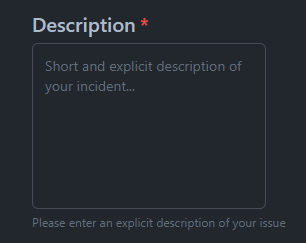
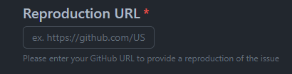
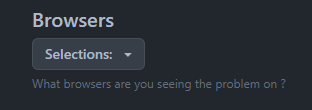
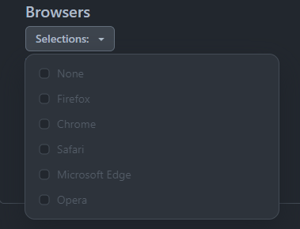

# Templates

All issue form configuration files must begin with `name`, `description` and `body` key-value pairs.

You can set the following top-level keys for each issue form.

| Key           | 	Description                                                                                                                                                                          | 	Required | 	Type                            |
|---------------|---------------------------------------------------------------------------------------------------------------------------------------------------------------------------------------|-----------|----------------------------------|
| `name`        | 	A name for the issue form template. Must be unique from all other templates, including Markdown templates.	                                                                          | Required  | 	String                          |
| `description` | 	A description for the issue form template, which appears in the template chooser interface.	                                                                                         | Required  | 	String                          |
| `body`        | 	Definition of the input types in the form.	                                                                                                                                          | Required  | 	Array                           |
| `assignees`   | 	People who will be automatically assigned to issues created with this template.	                                                                                                     | Optional  | 	Array or comma-delimited string |
| `labels`      | 	Labels that will automatically be added to issues created with this template. If a label does not already exist in the repository, it will not be automatically added to the issue.	 | Optional  | 	Array or comma-delimited string |
| `title`       | 	A default title that will be pre-populated in the issue submission form.	                                                                                                            | Optional  | 	String                          |
| `projects`    | Projects that any issues created with this template will automatically be added to. The format of this key is `PROJECT-OWNER/PROJECT-NUMBER`.                                         | Optional  | Array or comma-delimited string  |

For the available body input types and their syntax's, see [Syntax for GitHub's form schema](https://docs.github.com/en/communities/using-templates-to-encourage-useful-issues-and-pull-requests/syntax-for-githubs-form-schema).

### [Markdown](https://docs.github.com/en/communities/using-templates-to-encourage-useful-issues-and-pull-requests/syntax-for-githubs-form-schema#markdown)

```yml
- type: markdown
  attributes:
    value: "## Thank you for contributing to our project!"
- type: markdown
  attributes:
    value: |
      Thanks for taking the time to fill out this bug report.
```

### [Textarea](https://docs.github.com/en/communities/using-templates-to-encourage-useful-issues-and-pull-requests/syntax-for-githubs-form-schema#textarea)

<p align="center">
  
</p>

```yml
- type: textarea
  id: description
  attributes:
    label: "Description"
    description: Please enter an explicit description of your issue
    placeholder: Short and explicit description of your incident...
  validations:
    required: true
```

### [Input](https://docs.github.com/en/communities/using-templates-to-encourage-useful-issues-and-pull-requests/syntax-for-githubs-form-schema#input)

<p align="center">
  
</p>

```yml
- type: input
  id: reprod-url
  attributes:
    label: "Reproduction URL"
    description: Please enter your GitHub URL to provide a reproduction of the issue
    placeholder: ex. https://github.com/USERNAME/REPO-NAME
  validations:
    required: true
```

### [Dropdown](https://docs.github.com/en/communities/using-templates-to-encourage-useful-issues-and-pull-requests/syntax-for-githubs-form-schema#dropdown)

<p align="center">
  
</p>
<p align="center">
  
</p>

```yml
- type: dropdown
  id: browsers
  attributes:
    label: "Browsers"
    description: What browsers are you seeing the problem on ?
    multiple: true
    options:
      - Firefox
      - Chrome
      - Safari
      - Microsoft Edge
      - Opera
  validations:
    required: false
```

### [Checkbox](https://docs.github.com/en/communities/using-templates-to-encourage-useful-issues-and-pull-requests/syntax-for-githubs-form-schema#checkboxes)

```yml
- type: checkboxes
  id: terms
  attributes:
    label: Code of Conduct
    description: By submitting this issue, you agree to follow our [Code of Conduct](https://example.com)
    options:
      - label: I agree to follow this project's Code of Conduct
        required: true
```
