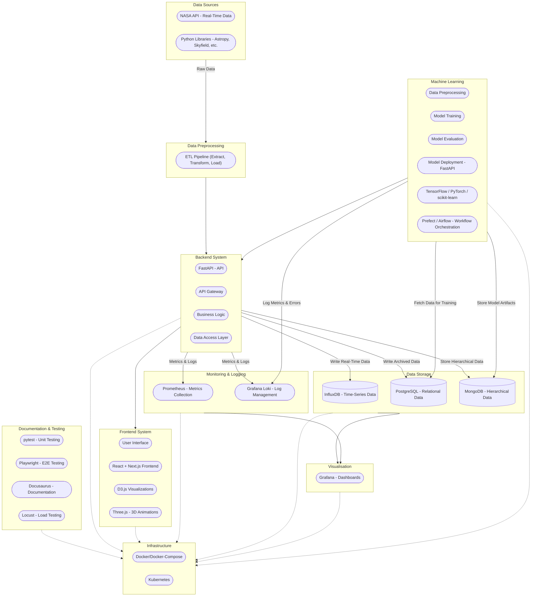

  
## Architecture  
  

  
## Data Flow  
  
- Data Source (NASA API / Python Libraries) provides initially raw and untransformed data that probably needs to be transformed into a suitable format (could contain various inconsistencies, missing values, or unstructured formats)  
- Move this data into the `Data Preprocessing` module where it goes through the `ETL (Extract, Transform, Load) Pipeline`  
- In the ETL pipeline the data gets:  
  - `Extracted`: The raw data is retrieved from the data source  
  - `Transformed`: The data gets cleaned, normalized, or reshaped to fit the systems needs  
  - `Loaded`: The transformed data is being passed to the backend where it gets stored in the storage systems  
- If the data is being stored in the databases via the backend, it can be queried through FastAPI endpoints via the frontend

## Workflow  

```mermaid  
sequenceDiagram  
    participant Source    participant ETL    participant Kafka    participant Backend    participant ML    participant InfluxDB    participant PostgreSQL    participant MongoDB    participant Grafana    participant Prometheus    participant Admin  
    %% Data Collection    Source->>ETL: Provide NASA API - Real-Time Data    Source->>ETL: Provide Python Libraries - Astropy, Skyfield, etc.        %% ETL Processing  
    ETL->>Kafka: Stream Preprocessed Data (Avro)    ETL->>Backend: Send Summary & Archived Data  
    %% Backend Processing    Backend->>InfluxDB: Write Real-Time Sensor Data    Backend->>PostgreSQL: Archive Summarized Data    Backend->>MongoDB: Store Hierarchical Data    Backend->>ML: Trigger ML Model for Analysis  
    %% ML Workflow    ML-->>Backend: Return Analysis Results    ML->>Workflow_Automation: Notify Retraining Required (Data Drift)  
    %% Prometheus Metrics    Backend->>Prometheus: Push Service Metrics    Prometheus-->>Grafana: Provide System Metrics  
    %% Monitoring & Logging    Backend->>Loki: Push Logs    Loki-->>Grafana: Provide Logs for Monitoring  
    %% Frontend Visualization    Backend-->>Grafana: Provide Data for Dashboards    Grafana->>Admin: Render System Dashboards    Grafana->>Admin: Render Data Dashboards  
    %% User Interaction    Admin->>Grafana: Interact with Dashboards    Admin->>Frontend: Access Reports and Visualizations  
```
  
